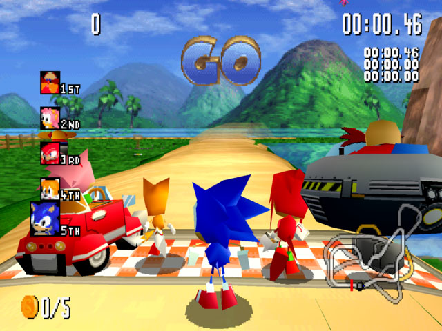

# Sega - Saturn (YabaSanshiro)

### Description

Yaba Sanshiro, also known as uoYabause, is a free and open-source Sega Saturn emulator based on Yabause.

This core is less accurate than Beetle-Saturn, but runs much faster and at higher resolution.

### License

GPLv2

### Icon

### Fanart

Help make me fanart!

### Screenshots

